<p align="center">
  <a href="https://simiancraft.github.io/react-native-webrtc-kaleidoscope/">
    
  </a>
</p>

<p align="center">
  <sub><b>This is the real camera, not a still pasted over a video.</b> The live segmentation mask holds one person while shipped presets swap in behind. Every icon below is a live preset, in the order the loop plays them; click one to run it on your own camera.</sub>
</p>

<p align="center">
  <a href="https://simiancraft.github.io/react-native-webrtc-kaleidoscope/?preset=blur-medium" title="Blur">🌫️</a> &nbsp;
  <a href="https://simiancraft.github.io/react-native-webrtc-kaleidoscope/?preset=kaleidoscope-mandala" title="Kaleidoscope mandala">🔮</a> &nbsp;
  <a href="https://simiancraft.github.io/react-native-webrtc-kaleidoscope/?preset=wizard-tower" title="Wizard's tower">🧙</a> &nbsp;
  <a href="https://simiancraft.github.io/react-native-webrtc-kaleidoscope/?preset=outrun-classic" title="Outrun grid">🌆</a> &nbsp;
  <a href="https://simiancraft.github.io/react-native-webrtc-kaleidoscope/?preset=observation-deck" title="Observation deck">🛸</a> &nbsp;
  <a href="https://simiancraft.github.io/react-native-webrtc-kaleidoscope/?preset=data-mesh-cobalt" title="Cobalt data-mesh">🔷</a> &nbsp;
  <a href="https://simiancraft.github.io/react-native-webrtc-kaleidoscope/?preset=fairy-grotto" title="Fairy grotto">🧚</a> &nbsp;
  <a href="https://simiancraft.github.io/react-native-webrtc-kaleidoscope/?preset=simianlights-hearth" title="Simianlights hearth">🪔</a> &nbsp;
  <a href="https://simiancraft.github.io/react-native-webrtc-kaleidoscope/?preset=simiancraft-dark" title="Simiancraft">🐒</a>
  &nbsp; <sub><a href="#presets">+ dozens more</a></sub>
</p>

<p align="center">
  <a href="https://simiancraft.github.io/react-native-webrtc-kaleidoscope/">
    
  </a>
</p>

<h1>
  &nbsp; react-native-webrtc-kaleidoscope
</h1>

[](https://www.npmjs.com/package/react-native-webrtc-kaleidoscope)
[](https://www.npmjs.com/package/react-native-webrtc-kaleidoscope)
[](https://github.com/simiancraft/react-native-webrtc-kaleidoscope/actions/workflows/ci.yml)
[](https://codecov.io/gh/simiancraft/react-native-webrtc-kaleidoscope)
[](https://securityscorecards.dev/viewer/?uri=github.com/simiancraft/react-native-webrtc-kaleidoscope)
[](./LICENSE)

> **Blur yourself, swap the room; live, on the device.** Real-time background blur and replacement for React Native and web video calls: bundled images, animated generative shaders, or painted worlds, each stenciled to the person by an on-device segmentation mask. Works with `react-native-webrtc` and LiveKit on Android, iOS, and Chromium browsers; managed-Expo-friendly.

Every other turnkey option we could find is a feature welded to one vendor's calling SDK (Stream, Agora, 100ms, and the rest). This one attaches to `react-native-webrtc` instead, so it rides whatever stack you already run, LiveKit included; and it is the only one we found that paints animated, generative-shader backgrounds, not just blur and a static image.

What you get:

- **[Bind a track once, then drive it with three verbs.](#the-three-verbs)** `kaleidoscope` swaps the background, `transform` reorients the frame, and `mask` tunes the segmentation edge. That is the entire runtime surface.
- **[Hand it to an agent and it wires itself.](#with-an-agent)** Point a coding agent at [`llms.txt`](./llms.txt) and it installs the package, writes the config plugin, provisions a preset book, and gets an effect on screen.
- **[Drop-in components, not a pipeline to assemble.](#quick-start)** A picker that reads your preset book, a headless live-editor, and a persistence provider; one import each, wire a callback, done.
- **[Dozens of presets out of the box.](#presets)** Blur, painted worlds, bundled rooms, and animated shaders; every one is a starting point you can retune.
- **[See what every effect costs.](#performance)** Each shader carries a measured GPU-cost annotation and the resolution tier is one knob, so you size the spend before you ship it.
- **[Bench, meter, and thumbnail tools included.](#authoring-tooling)** A SPIR-V cost bench, a live GPU-time meter, a thumbnail renderer, and this README's preset gallery all regenerate from one command set.
- **[Ship only the presets you reference.](#only-ship-what-you-use)** Per-asset subpath exports plus `sideEffects: false`; web tree-shakes by import and `expo prebuild` copies only the assets your book names into the native bundle.
- **[A new shader is one folder.](#make-your-own-presets)** Every effect is a layer in one [compositor](#architecture); drop a `.frag` into `catalog/shaders/` and it codegens to web, Android, and iOS, masked and oriented for free.

## Presets

Like a synthesizer, the fastest way to judge it is to hear the patches. The demo book ships the gallery below; **every tile is a live link**, so click one and it opens on your own camera. Bring your own with a few lines (see [Make your own presets](#make-your-own-presets)).

<!-- PRESET-WAFFLE:START -->

<sub><b>Effects</b></sub>

<sub>Blur</sub><br />
<a href="https://simiancraft.github.io/react-native-webrtc-kaleidoscope/?preset=blur-low" title="Low"></a> <a href="https://simiancraft.github.io/react-native-webrtc-kaleidoscope/?preset=blur-medium" title="Medium"></a> <a href="https://simiancraft.github.io/react-native-webrtc-kaleidoscope/?preset=blur-high" title="High"></a>

<sub><b>Worlds</b></sub>

<sub>Wizard Tower</sub><br />
<a href="https://simiancraft.github.io/react-native-webrtc-kaleidoscope/?preset=wizard-tower" title="Wizard Tower"></a> <a href="https://simiancraft.github.io/react-native-webrtc-kaleidoscope/?preset=wizard-tower-night" title="Night">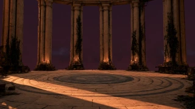</a>

<sub>Spaceship</sub><br />
<a href="https://simiancraft.github.io/react-native-webrtc-kaleidoscope/?preset=observation-deck" title="Observation Deck">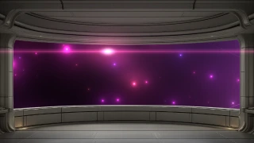</a>

<sub>Fairy Cave</sub><br />
<a href="https://simiancraft.github.io/react-native-webrtc-kaleidoscope/?preset=fairy-cave" title="Fairy Cave"></a> <a href="https://simiancraft.github.io/react-native-webrtc-kaleidoscope/?preset=fairy-grotto" title="Grotto"></a> <a href="https://simiancraft.github.io/react-native-webrtc-kaleidoscope/?preset=fairy-hollow" title="Hollow"></a>

<sub>Ocean</sub><br />
<a href="https://simiancraft.github.io/react-native-webrtc-kaleidoscope/?preset=underwater" title="Underwater"></a>

<sub>Corporate</sub><br />
<a href="https://simiancraft.github.io/react-native-webrtc-kaleidoscope/?preset=corporate-blobs" title="Blobs"></a>

<sub>Interior</sub><br />
<a href="https://simiancraft.github.io/react-native-webrtc-kaleidoscope/?preset=interior-home" title="Home"></a> <a href="https://simiancraft.github.io/react-native-webrtc-kaleidoscope/?preset=interior-office" title="Office"></a> <a href="https://simiancraft.github.io/react-native-webrtc-kaleidoscope/?preset=interior-ab-shaft" title="A/B 1-shaft"></a> <a href="https://simiancraft.github.io/react-native-webrtc-kaleidoscope/?preset=interior-ab-3beam" title="A/B 3-beam"></a>

<sub><b>Backgrounds</b></sub>

<sub>Simiancraft</sub><br />
<a href="https://simiancraft.github.io/react-native-webrtc-kaleidoscope/?preset=simiancraft-light" title="Simiancraft Light"></a> <a href="https://simiancraft.github.io/react-native-webrtc-kaleidoscope/?preset=simiancraft-dark" title="Simiancraft Dark">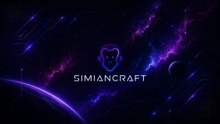</a>

<sub>Office</sub><br />
<a href="https://simiancraft.github.io/react-native-webrtc-kaleidoscope/?preset=office-dark" title="Dark Office"></a> <a href="https://simiancraft.github.io/react-native-webrtc-kaleidoscope/?preset=office-light" title="Light Office"></a>

<sub>Nature</sub><br />
<a href="https://simiancraft.github.io/react-native-webrtc-kaleidoscope/?preset=landscape-light" title="Nature Light"></a> <a href="https://simiancraft.github.io/react-native-webrtc-kaleidoscope/?preset=landscape-dark" title="Nature Dark"></a>

<sub>Home</sub><br />
<a href="https://simiancraft.github.io/react-native-webrtc-kaleidoscope/?preset=home-light" title="Home Light"></a> <a href="https://simiancraft.github.io/react-native-webrtc-kaleidoscope/?preset=home-dark" title="Home Dark">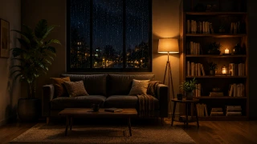</a>

<sub>Sci-Fi</sub><br />
<a href="https://simiancraft.github.io/react-native-webrtc-kaleidoscope/?preset=sci-fi-light" title="Landscape"></a>

<sub>Ocean</sub><br />
<a href="https://simiancraft.github.io/react-native-webrtc-kaleidoscope/?preset=oceanscape-dark" title="Underwater"></a>

<sub>Debug</sub><br />
<a href="https://simiancraft.github.io/react-native-webrtc-kaleidoscope/?preset=debug-resolutions" title="Resolutions">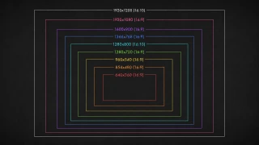</a>

<sub>User</sub><br />
<a href="https://simiancraft.github.io/react-native-webrtc-kaleidoscope/?preset=wolf-cave" title="Wolf Cave"></a>

<sub><b>Shaders</b></sub>

<sub>Sky</sub><br />
<a href="https://simiancraft.github.io/react-native-webrtc-kaleidoscope/?preset=clouds" title="Daytime"></a> <a href="https://simiancraft.github.io/react-native-webrtc-kaleidoscope/?preset=clouds-dawn" title="Dawn"></a> <a href="https://simiancraft.github.io/react-native-webrtc-kaleidoscope/?preset=clouds-dusk" title="Dusk"></a> <a href="https://simiancraft.github.io/react-native-webrtc-kaleidoscope/?preset=clouds-night" title="Night"></a> <a href="https://simiancraft.github.io/react-native-webrtc-kaleidoscope/?preset=clouds-otherworld" title="Otherworld"></a>

<sub>Plasma</sub><br />
<a href="https://simiancraft.github.io/react-native-webrtc-kaleidoscope/?preset=plasma-ocean" title="Ocean"></a> <a href="https://simiancraft.github.io/react-native-webrtc-kaleidoscope/?preset=plasma-sunset" title="Sunset"></a> <a href="https://simiancraft.github.io/react-native-webrtc-kaleidoscope/?preset=plasma-mint" title="Mint"></a> <a href="https://simiancraft.github.io/react-native-webrtc-kaleidoscope/?preset=plasma-fast" title="Fast"></a>

<sub>Kaleidoscope</sub><br />
<a href="https://simiancraft.github.io/react-native-webrtc-kaleidoscope/?preset=kaleidoscope-stained-glass" title="Stained Glass"></a> <a href="https://simiancraft.github.io/react-native-webrtc-kaleidoscope/?preset=kaleidoscope-mandala" title="Mandala"></a> <a href="https://simiancraft.github.io/react-native-webrtc-kaleidoscope/?preset=kaleidoscope-prism" title="Prism"></a>

<sub>Neo-Memphis</sub><br />
<a href="https://simiancraft.github.io/react-native-webrtc-kaleidoscope/?preset=neo-memphis-jazz-cup" title="Jazz Cup">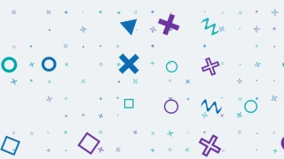</a> <a href="https://simiancraft.github.io/react-native-webrtc-kaleidoscope/?preset=neo-memphis-bauhaus" title="Bauhaus"></a> <a href="https://simiancraft.github.io/react-native-webrtc-kaleidoscope/?preset=neo-memphis-confetti" title="Confetti">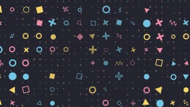</a>

<sub>Halftone</sub><br />
<a href="https://simiancraft.github.io/react-native-webrtc-kaleidoscope/?preset=halftone-boardroom" title="Boardroom">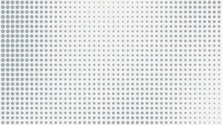</a> <a href="https://simiancraft.github.io/react-native-webrtc-kaleidoscope/?preset=halftone-press" title="Press">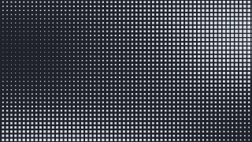</a> <a href="https://simiancraft.github.io/react-native-webrtc-kaleidoscope/?preset=halftone-ripple" title="Ripple"></a>

<sub>Aurora</sub><br />
<a href="https://simiancraft.github.io/react-native-webrtc-kaleidoscope/?preset=aurora-corporate-silk" title="Corporate Silk"></a> <a href="https://simiancraft.github.io/react-native-webrtc-kaleidoscope/?preset=aurora-dusk" title="Dusk"></a> <a href="https://simiancraft.github.io/react-native-webrtc-kaleidoscope/?preset=aurora-polar" title="Polar"></a>

<sub>Outrun</sub><br />
<a href="https://simiancraft.github.io/react-native-webrtc-kaleidoscope/?preset=outrun-classic" title="Classic">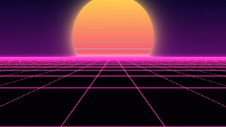</a> <a href="https://simiancraft.github.io/react-native-webrtc-kaleidoscope/?preset=outrun-miami" title="Miami">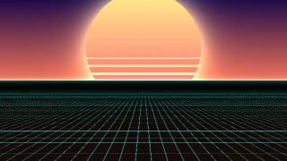</a> <a href="https://simiancraft.github.io/react-native-webrtc-kaleidoscope/?preset=outrun-circuit" title="Circuit"></a> <a href="https://simiancraft.github.io/react-native-webrtc-kaleidoscope/?preset=outrun-acid" title="Acid">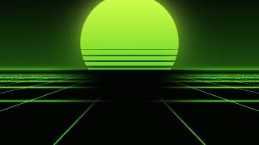</a> <a href="https://simiancraft.github.io/react-native-webrtc-kaleidoscope/?preset=outrun-vapor" title="Vapor">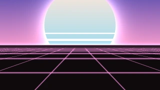</a>

<sub>Nebula</sub><br />
<a href="https://simiancraft.github.io/react-native-webrtc-kaleidoscope/?preset=nebula" title="Nebula"></a> <a href="https://simiancraft.github.io/react-native-webrtc-kaleidoscope/?preset=nebula-ember" title="Ember">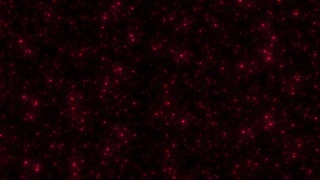</a> <a href="https://simiancraft.github.io/react-native-webrtc-kaleidoscope/?preset=nebula-drift" title="Drift"></a>

<sub>Simianlights</sub><br />
<a href="https://simiancraft.github.io/react-native-webrtc-kaleidoscope/?preset=simianlights" title="Simianlights"></a> <a href="https://simiancraft.github.io/react-native-webrtc-kaleidoscope/?preset=simianlights-glacier" title="Glacier"></a> <a href="https://simiancraft.github.io/react-native-webrtc-kaleidoscope/?preset=simianlights-hearth" title="Hearth"></a>

<sub>Data-Mesh</sub><br />
<a href="https://simiancraft.github.io/react-native-webrtc-kaleidoscope/?preset=data-mesh-datafield" title="Datafield"></a> <a href="https://simiancraft.github.io/react-native-webrtc-kaleidoscope/?preset=data-mesh-boardroom" title="Boardroom"></a> <a href="https://simiancraft.github.io/react-native-webrtc-kaleidoscope/?preset=data-mesh-acid" title="Acid"></a> <a href="https://simiancraft.github.io/react-native-webrtc-kaleidoscope/?preset=data-mesh-cobalt" title="Cobalt"></a> <a href="https://simiancraft.github.io/react-native-webrtc-kaleidoscope/?preset=data-mesh-slate" title="Slate"></a>

<sub>64 presets ship in the demo book across 4 families (Effects, Worlds, Backgrounds, Shaders); click any tile to open it live. Bring your own with a few lines; see <a href="#make-your-own-presets">Make your own presets</a>.</sub>

<!-- PRESET-WAFFLE:END -->

<sub>Runs on Android, iOS, and Chromium browsers (Chrome, Edge), against either `react-native-webrtc` or LiveKit. Platform specifics and the Safari/Firefox fallback are in [Platform support](#platform-support).</sub>

## Quick start

Two paths to a working integration: hand it to a coding agent, or wire it yourself. Either way the shape is the same: install, add the config plugin, declare a preset book, bind a track.

### With an agent

Point your coding agent (Claude Code, Cursor, Copilot, …) at [`llms.txt`](./llms.txt). It is written for exactly this: a top-to-bottom integration guide that installs the package, writes the config-plugin entry, provisions a runnable preset book, and gets an effect on screen, with a six-file starting set lifted from the working `demo/`.

```
Read https://raw.githubusercontent.com/simiancraft/react-native-webrtc-kaleidoscope/main/llms.txt
and integrate react-native-webrtc-kaleidoscope into this Expo app: add the config
plugin, create a starter preset book, and show the PresetBookMenu over my camera track.
```

### Manually

```sh
bun add react-native-webrtc react-native-webrtc-kaleidoscope
```

`react-native-webrtc` is a peer dependency; install it explicitly. (Using LiveKit instead? See [Using LiveKit](#using-livekit).) Add the config plugin to `app.config.ts`, then rebuild native code:

```ts
export default { expo: { plugins: ['react-native-webrtc-kaleidoscope'] } };
```

```sh
bunx expo prebuild
```

Declare a **preset book**: a flat catalog of the effects you can command. A rudimentary one is three entries:

```ts
// kaleidoscope.preset-book.ts
import type { KaleidoscopePresetBook } from 'react-native-webrtc-kaleidoscope';
import { officeDark } from 'react-native-webrtc-kaleidoscope/images/office/office-dark';
import { wizardTower } from 'react-native-webrtc-kaleidoscope/composites/wizard-tower';

export const presets = {
  'blur-soft': {
    name: 'Soft blur',
    taxonomy: ['Effects', 'Blur'],
    layers: [
      { id: 'bg', shader: 'blur', target: 'background', uniforms: { sigma: 5 } },
      { id: 'you', shader: 'direct', target: 'subject' },
    ],
  },
  'office-dark': {
    name: 'Dark office',
    taxonomy: ['Backgrounds', 'Office'],
    thumbnail: officeDark,
    layers: [
      { id: 'office', shader: 'image', source: officeDark },
      { id: 'you', shader: 'direct', target: 'subject' },
    ],
  },
  // A packaged multi-layer world, imported and spread in.
  'wizard-tower': wizardTower,
} as const satisfies KaleidoscopePresetBook;
```

Bind a track once and drive it:

```ts
import { mediaDevices } from 'react-native-webrtc';
import { bindKaleidoscope } from 'react-native-webrtc-kaleidoscope';
import { presets } from './kaleidoscope.preset-book';

const stream = await mediaDevices.getUserMedia({ video: true });
const [track] = stream.getVideoTracks();

const { kaleidoscope } = bindKaleidoscope(track, {
  presets,
  // Web rebuilds the pipeline per command and yields a NEW track; read it here.
  // Native mutates the bound track in place.
  onTrack: (out) => {/* setPreviewTrack(out) */},
});

kaleidoscope('wizard-tower'); // autocompletes from your book
```

For a ready-made gallery, drop in the picker; it reads your book directly:

```tsx
import { PresetBookMenu } from 'react-native-webrtc-kaleidoscope/preset-book-menu';
import { presets } from './kaleidoscope.preset-book';

<PresetBookMenu presets={presets} value={art} onSelect={setArt} />;
// route onSelect into kaleidoscope() and the picker is wired.
```

Want the selection, live tweaks, and mask edge to survive a reload? Wrap your app in the [persistence provider](#persistence). Want the styled UI and a live tuning panel? See [Drop-in UI](#drop-in-ui).

### Using LiveKit

If your project uses `@livekit/react-native` it pulls in `@livekit/react-native-webrtc`, a fork that preserves the same `videoEffects` native classes and `_setVideoEffects` JS API. Kaleidoscope works against either fork; the Android Gradle script picks whichever one autolinking surfaced. Pick **one** fork, never both, or the native classes collide.

```sh
bun add @livekit/react-native @livekit/react-native-webrtc react-native-webrtc-kaleidoscope
```

On native, `@livekit/react-native` hands you a `LocalVideoTrack`; bind to its underlying `MediaStreamTrack`:

```ts
const { kaleidoscope } = bindKaleidoscope(localCameraTrack.mediaStreamTrack, { presets });
kaleidoscope('blur-soft');
```

On web, LiveKit owns the `RTCRtpSender`, so you cannot swap the track yourself; go through LiveKit's processor API. The opt-in `/livekit` subpath ships a ready-made processor (it needs `livekit-client`, which a LiveKit app already has):

```ts
import { KaleidoscopeProcessor, setMaskTuning } from 'react-native-webrtc-kaleidoscope/livekit';

await localVideoTrack.setProcessor(new KaleidoscopeProcessor(['blur']), true);
setMaskTuning({ hardness: 0.2, threshold: 0.85 }); // the processor-path twin of the `mask` verb
```

The processor constructor takes raw effect names (`'blur'`, a shader basename), not preset-book ids. The `true` shows the processed stream in your local preview. The processor tears down its Insertable-Streams pipeline on camera flip (`restart`) and unpublish (`destroy`), so repeated flips do not leak generators.

## Concepts

Four nouns, learned in the order you meet them.

- **Preset book**: the file you author (`kaleidoscope.preset-book.ts`); a flat, typed map of the effects your app can command. This is your point of entry; everything else hangs off it. Declare it `as const satisfies KaleidoscopePresetBook` for per-layer typing and autocompleting ids.
- **Preset**: one named entry in the book, `{ name, taxonomy, thumbnail?, layers, controls? }`. It is what `kaleidoscope(id)` applies. `taxonomy` is the picker's grouping path, root first (`[group, category]`, e.g. `['Backgrounds', 'Office']`).
- **Layer**: one entry in a preset's stack, `{ id, shader, target?, blend? }` plus the shader's own fields. Layers paint back to front. `id` is unique within the preset and is how you address it for live uniform patches.
- **Composite**: what a preset becomes at runtime, the layer stack rendered into the output frame. There is exactly one registered native effect, `composite`; "one effect" is just a composite with a single layer.

A layer's `shader` is what it draws: `image` (a bundled WebP, takes a `source`), `direct` (the ingest-normalized camera frame, upright and non-mirrored), `blur`, or a generative shader (`plasma`, `clouds`, …; these take `uniforms`). Its `target` is where it lands: `background` (fullscreen, the default) or `subject` (stenciled to the segmented person), and the two combine: `direct` + `subject` is the masked person, `direct` + `background` is the raw full frame. Its `blend` is how it stacks: opaque base, `normal` (alpha-over), or `additive`.

## The three verbs

<p align="center">
  <code>kaleidoscope</code> &nbsp;•&nbsp; <code>transform</code> &nbsp;•&nbsp; <code>mask</code>
</p>

`bindKaleidoscope(track, { presets })` returns three functions. That is the whole runtime API.

```ts
const { kaleidoscope, transform, mask } = bindKaleidoscope(track, { presets, onTrack });

// kaleidoscope: the art axis. Pass a preset id (autocompletes from your book):
kaleidoscope('wizard-tower');
// Override a layer's uniforms live, addressed by id, while the preset is active
// (merged over the baked values, no pipeline rebuild). `shader` is a compile-time
// discriminant that types `uniforms`; the layer is reached by `id`, not by shader:
kaleidoscope('blur-soft', [{ id: 'bg', shader: 'blur', uniforms: { sigma: 9 } }]);
kaleidoscope(null);                          // clear the art

// transform: absolute geometry. Every call is the full state from identity;
// re-pass what you want to keep. rotate snaps to the nearest 90°.
transform({ flip: { x: true }, rotate: 90 });
transform();                                 // reset to identity

// mask: one segmentation edge for the whole composite (not per layer). Both 0..1.
mask({ hardness: 0.5, threshold: 0.5 });
```

Many uniforms are normalized `0..1` by convention; others (`sigma`, scales, counts) carry natural units, as the examples above show. JSDoc documents each option's expected range as an IntelliSense hint (ranges are not enforced at runtime; validate in your own layer if you forward them to end users).

**Tuning note.** All three platforms run MediaPipe selfie segmentation, so the mask edge that suits one may differ slightly from another. `mask` defaults to `0.5 / 0.5`; nudge `hardness` and `threshold` to match your camera and lighting.

## Make your own presets

A preset is a composition: **every preset is a back-to-front stack of N layers**, and the compositor does not care what produces a layer's texture, which is exactly what makes it extensible. To author one, stack layers in the order you want them painted, lowest first, the masked person (`{ shader: 'direct', target: 'subject' }`) usually last so it sits on top.

```ts
// A generative shader behind the person, with an additive glow layer on top of it.
'aurora-night': {
  name: 'Aurora night',
  taxonomy: ['Shaders', 'Aurora'],
  layers: [
    { id: 'sky',  shader: 'clouds',   target: 'background', uniforms: { coverage: 0.4 } },
    { id: 'glow', shader: 'godrays',  target: 'background', blend: 'additive' },
    { id: 'you',  shader: 'direct',   target: 'subject' },
  ],
},
```

The packaged `wolf-cave` preset in the [demo book](./demo/kaleidoscope.preset-book.ts) is a worked example of a multi-layer world (a generative shader, a cut-out image, and the masked person).

- **Bundled images** ship as tree-shakeable `image` layers, filed by category and imported per image (`import { officeDark } from 'react-native-webrtc-kaleidoscope/images/office/office-dark'`). On web a `source` can also be any image URL or data URI; native resolves bundled ids only. See [`catalog/images/README.md`](./catalog/images/README.md).
- **New shaders** drop a single `.frag` + typed `.ts` into `catalog/shaders/<name>/`; `bun run build:shaders` codegens the web and Android sources and transpiles the iOS Metal. The canonical upright frame and the mask stencil come for free; you write zero orientation code. See [`catalog/shaders/README.md`](./catalog/shaders/README.md).
- **Packaged composites** (the Worlds) live in `catalog/composites/<name>/` behind a `./composites/<name>` subpath export; import and spread one into your book.

After adding a preset to the demo book, regenerate its thumbnail and this README's gallery: `bun run thumbs && bun run gen:waffle` (see [Authoring tooling](#authoring-tooling)).

## Drop-in UI

Build your own controls against the three verbs, or import the headless, controlled components. All are presentational: they emit a selection or a patch, you apply it.

### The picker

`PresetBookMenu` (from `react-native-webrtc-kaleidoscope/preset-book-menu`) is a two-level browser driven by each preset's `taxonomy`: a tab row across the top, one tab per **group** (`taxonomy[0]`), and a left-hand menu of **categories** (`taxonomy[1]`) under the active group; the tile grid filters by both. A flat (depth-1) group shows no category menu. Every preset renders as a uniform tile: a wallpaper when it has a `thumbnail`, a recessed button of the same footprint when it does not, so a thumbnail-less preset never breaks the grid. The same pieces ship as standalone primitives (`PresetGrid`, `PresetTile`, the `usePresetBookMenu` hook, `PresetBookMenuLayout`) for custom layouts.

**Styling, three tiers.** Sensible defaults out of the box; override with an RN `style` prop, a `className` prop, or a `renderTile` render-prop slot for full control.

**NativeWind-ready.** The components accept `className`. Turn it on by importing the opt-in registration once (`nativewind` is an optional peer; the core `./preset-book-menu` import never pulls it in):

```ts
import { registerKaleidoscopeNativeWind } from 'react-native-webrtc-kaleidoscope/nativewind';
registerKaleidoscopeNativeWind();
```

### Live controls (the editor)

For a tuning or admin panel, `react-native-webrtc-kaleidoscope/preset-control-panel` ships a headless editor that reads the active preset and renders a control per tunable uniform, plus the mask and transform panels:

```tsx
import {
  KaleidoscopeThemeProvider,
  PresetControlPanel,
  MaskControlPanel,
  TransformControlPanel,
} from 'react-native-webrtc-kaleidoscope/preset-control-panel';

<KaleidoscopeThemeProvider>
  <PresetControlPanel presets={presets} value={art} onPatch={(p) => controls.kaleidoscope(art, [p])} />
  <MaskControlPanel hardness={h} threshold={t} onChange={setMask} />
  <TransformControlPanel flip={flip} rotate={rotate} onChange={setTransform} />
</KaleidoscopeThemeProvider>
```

Each preset supplies its editor as a `controls` component on the book entry; packaged composites export theirs at `react-native-webrtc-kaleidoscope/composites/<name>/controls`. For your own presets, compose `CompositeLayerControlPanel` over a shader's control descriptor (or `makeControls` for a custom widget). `KaleidoscopeThemeProvider` themes every control at once. The sliders need `@react-native-community/slider` (an optional peer; a native module, so it needs a dev-client rebuild). Live per-layer tuning runs on web today; on native the editor renders while the live per-layer uniform channel is in progress. Mask and transform are live on every platform.

### Persistence

`react-native-webrtc-kaleidoscope/persistence` ships a provider + hook that keep the person's selection across launches: the last applied preset id, the per-layer uniform patches they dialed in (kept per preset), and the mask edge.

```tsx
// App root:
import { KaleidoscopeStateProvider } from 'react-native-webrtc-kaleidoscope/persistence';
<KaleidoscopeStateProvider presets={presets}><App /></KaleidoscopeStateProvider>;

// In the screen that binds the track:
import { useKaleidoscopeState } from 'react-native-webrtc-kaleidoscope/persistence';
const { hydrated, presetId, mask, setPreset, setMask, setPatch, patchesFor, reset } =
  useKaleidoscopeState<typeof presets>();

useEffect(() => {
  if (!hydrated || !controls) return; // wait: don't flash the default over the restored preset
  if (presetId) controls.kaleidoscope(presetId, patchesFor(presetId));
  else controls.kaleidoscope(null);
}, [hydrated, controls, presetId]);
```

Route the picker's `onSelect` into `setPreset`, the editor's `onPatch` into `setPatch(presetId, patch)`, and the mask panel into `setMask`; every write persists. The default store is [`@react-native-async-storage/async-storage`](https://github.com/react-native-async-storage/async-storage) (an optional peer; localStorage-backed on web). Back it with anything else (MMKV, a server) by passing a `{ load, save }` pair as the `store` prop; the stored shape is versioned and parses tolerantly, so a malformed payload reads as empty rather than throwing.

## Performance

The product is the masked-background composite, and its cost is something you can see, not guess.

- **Annotated shader cost.** Each generative shader's `.ts` carries a measured GPU cost annotation (relative to `plasma` as the cheap baseline), so you know what a preset spends before you ship it.
- **One resolution knob.** Raw shader compute scales with output resolution, handled by the resolution tier (`targetShortSide`), not by per-effect orientation tricks. Drop the tier on weak GPUs; the mask and composite logic are unchanged.
- **Bounded work per frame.** Compositing is per-layer through a single mask stencil; a new shader inherits the pipeline's frame budget rather than adding a pass of its own.

## Authoring tooling

The kit ships the same tools used to build it. All regenerate from the command line.

| Command | What it does |
|---|---|
| `bun run bench:shader` | SPIR-V weighted op-cost bench for a shader (good for no-loop shaders; rank by the meter for loop-bound ones). |
| `bun run shader:view` | WebGL2 A/B viewer with a live GPU-time meter for tuning a shader against the camera. |
| `bun run thumbs` | Render a `320×180` WebP thumbnail per preset in a book (the gallery tiles and picker wallpapers). |
| `bun run gen:waffle` | Regenerate this README's [preset gallery](#presets) from the demo book + thumbnails. Run after adding a preset; `--check` gates staleness. |

## Only ship what you use

Install size and bundle size are different numbers, and you pay for the second.

- **Per-asset subpath exports.** Each bundled image and packaged composite is its own file behind its own subpath (`./images/<category>/<leaf>`, `./composites/<name>`), and the package sets `sideEffects: false`. A web bundler drops every preset you do not import.
- **Native ships only what your book references.** Metro does not tree-shake, so an unused preset is simply never imported; and `expo prebuild` copies only the assets your preset book actually names into the native bundle. Declare ten rooms, reference two, ship two.
- **Assets are WebP.** Backgrounds are 720p WebP; each platform decodes it natively (BitmapFactory on Android, ImageIO / MTKTextureLoader on iOS), so a full image set is a couple of megabytes, not sixteen.

## For LLMs and agents

Feeding this repo into Claude / Cursor / Copilot, or shipping it into an app with an agent? Read [`llms.txt`](./llms.txt) first: the same scope as this README in a denser, parseable shape, with a copy-paste starting fileset that runs on all three platforms. It is the file to hand an agent for a hands-off integration (see [Quick start → With an agent](#with-an-agent)).

## Architecture

Every effect is a **layer in one compositor**: a bundled `image`, a `direct` passthrough (the masked person or the raw camera), a camera-sampling `blur`, or a generative shader, composited back to front with per-layer blend. There is one registered native effect, `composite`; its layer stack is delivered out of band and reconciled each command. Adding a background source is adding a layer kind, not a new effect, which is why [a new shader](#make-your-own-presets) reaches all three platforms from one folder.

Canonical assets live in three root, folder-per-item directories, out of the TypeScript build path:

- `catalog/shaders/<name>/`: each shader's `.frag` plus its typed `.ts` (uniforms + control descriptor). All share one vertex stage; `bun run build:shaders` codegens the web and Android sources and transpiles the iOS Metal.
- `catalog/images/<category>/`: images filed by category; each is a `<leaf>.webp`, its `<leaf>.thumb.webp`, and the `<leaf>.ts` / `<leaf>.web.ts` loader pair, behind a subpath export.
- `catalog/composites/<name>/`: each packaged composite, behind a `./composites/<name>` subpath export.

The code spans the platform surfaces: `src/` (JS facade + shared types), `web-driver/` (WebGL2 pipeline), `android/` (OpenGL ES 3.0), and `ios/` (Metal). Orientation is normalized exactly once at the ingest, so effects do zero orientation work. The full contract, including the texture-orientation convention and the mask buffer-ownership rule, is in [`PATTERNS.md`](./PATTERNS.md).

## Platform support

| Platform | Transform | Blur | Background replacement | Notes |
|---|---|---|---|---|
| Web (Chrome / Edge) | ✓ | ✓ | ✓ | MediaStreamTrackProcessor + MediaPipe Selfie Segmentation (WASM, CDN) |
| Android (API 24+) | ✓ | ✓ | ✓ | OpenGL ES 3.0 + MediaPipe Selfie Segmentation (Tasks) |
| iOS (≥ 15) | ✓ | ✓ | ✓ | Metal + MediaPipe Selfie Segmentation (Tasks), verified on device. Older A11 devices (iPhone X) run at a lower frame rate |
| Safari / Firefox | n/a | n/a | n/a | No Insertable Streams; the effects throw a clear capability error and the demo falls back to the unprocessed track |

A few runtime differences worth knowing before you wire effects in:

- **Output track.** On web each `kaleidoscope` / `transform` command rebuilds the Insertable-Streams pipeline and yields a NEW `MediaStreamTrack` via `onTrack`; on native the bound track is mutated in place. `mask` updates the running composite with no rebuild on either platform.
- **Segmentation model on web.** The web compositor loads MediaPipe Selfie Segmentation from the jsDelivr CDN on first use. A strict Content-Security-Policy must allow that origin for `script-src`, `connect-src`, and the WASM fetch, and the effects do not work offline. `transform` needs no model.
- **Android revokes the camera ~60 s into the background.** Android 11+ disables camera access for backgrounded apps by device policy; `react-native-webrtc` logs it but never restarts capture, so after a long background the preview stays black on resume. Re-acquire `getUserMedia` when the app returns from the background; the demo's [`use-loopback-stream.ts`](./demo/src/use-loopback-stream.ts) shows the `AppState` pattern, and effects re-bind to the new track through the normal verbs.

## What this isn't

- **Not a fork of `react-native-webrtc`.** A thin layer over its undocumented `_setVideoEffects` registry on native, and `MediaStreamTrackProcessor` on web. Install alongside it.
- **Not a managed cloud SaaS.** Effects run locally on the device; the track stays peer-to-peer. No service, no API key, no per-minute billing.
- **Not a face-filter SDK.** Effects are background segmentation and frame transforms, not facial AR.
- **Not a streaming protocol replacement.** The transformed track plugs into your existing `RTCPeerConnection` pipeline.

## Reference

- [CHANGELOG.md](./CHANGELOG.md): release history (semantic-release, Conventional Commits).
- [CONTRIBUTING.md](./CONTRIBUTING.md): setup, scripts, commit conventions.
- [AGENTS.md](./AGENTS.md): contributor and agent orientation for working on the repo.
- [PATTERNS.md](./PATTERNS.md): codebase conventions, the orientation contract, and how to extend.
- [catalog/shaders/README.md](./catalog/shaders/README.md): adding and extending shaders.
- [catalog/images/README.md](./catalog/images/README.md): the image folder layout and formats.
- [llms.txt](./llms.txt): dense, agent-oriented integration guide.
- [SECURITY.md](./SECURITY.md): security policy and reporting.
- [NOTICE.md](./NOTICE.md): third-party attributions.

---

MIT licensed. © 2026 Jesse Harlin / [Simiancraft](https://github.com/simiancraft).

<p align="center"><sub>Crafted with care by <a href="https://simiancraft.com">Simiancraft</a>.</sub></p>
