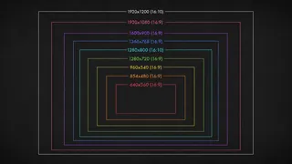

<p align="center">
  
</p>

# react-native-webrtc-kaleidoscope

[](#status)
[](https://www.npmjs.com/package/react-native-webrtc-kaleidoscope)
[](https://www.npmjs.com/package/react-native-webrtc-kaleidoscope)
[](https://github.com/simiancraft/react-native-webrtc-kaleidoscope/actions/workflows/ci.yml)
[](https://codecov.io/gh/simiancraft/react-native-webrtc-kaleidoscope)
[](https://securityscorecards.dev/viewer/?uri=github.com/simiancraft/react-native-webrtc-kaleidoscope)
[](./LICENSE)

<p align="center">
  <code>kaleidoscope</code> &nbsp;•&nbsp; <code>transform</code> &nbsp;•&nbsp; <code>mask</code>
</p>

> Creative, shader-based video effects for React Native video calls: blur or replace a person's background in a teleconference. Works with `react-native-webrtc` and LiveKit, managed-Expo-friendly.

**Bind a track once, then drive it with three verbs.** `kaleidoscope` swaps the background effect (blur, a still image, or a procedural shader), `transform` reorients the frame, and `mask` tunes the segmentation edge. The effects you can command are a typed preset book you declare in your own project; at `expo prebuild`, only the assets you actually reference ship in your native bundle.

## Status

**Active development; not yet production-ready.** Published to npm (the badge shows the current version, which tracks release automation rather than maturity). Presentation and install-doc polish come later; for now the README documents what works.

### What works today

- **`kaleidoscope`**: the art axis. Blur, a bundled background image (ten themed backgrounds plus a calibration grid, or your own assets), or a procedural shader, commanded by preset name. The generative shaders that ship are `plasma`, `clouds`, `godrays`, `fireflies`, `nebula`, `simianlights`, `anamorphic-lensflare`, `light-beams-and-motes`, and `corporate-blobs`.
- **`transform`**: absolute flips and rotation (snapped to 90°), reapplied as full state each call.
- **`mask`**: the segmentation edge (hardness, threshold) shared by every art effect.
- **Tree-shaking**: declare a preset book; only the assets you reference ship in your native bundle (web tree-shakes by import).
- **Drop-in UI (optional)**: a preset-driven `KaleidoscopePicker` (the menu) under `react-native-webrtc-kaleidoscope/ui`, plus a headless live-editor kit (`KaleidoscopeTuner`, mask and transform controls, a theme provider) under `react-native-webrtc-kaleidoscope/controls`. Controlled and NativeWind-ready. See [Drop-in UI](#drop-in-ui-optional).

| Platform | Transform | Blur | Background replacement | Notes |
|---|---|---|---|---|
| Web (Chrome / Edge) | ✓ | ✓ | ✓ | MediaStreamTrackProcessor + MediaPipe Selfie Segmentation (WASM, CDN) |
| Android (API 24+) | ✓ | ✓ | ✓ | OpenGL ES 3.0 + MediaPipe Selfie Segmentation (Tasks) |
| iOS (≥ 15) | ✓ | ✓ | ✓ | Metal + MediaPipe Selfie Segmentation (Tasks), verified on device. Older A11 devices (iPhone X) run at a lower frame rate |
| Safari / Firefox | — | — | — | No Insertable Streams; the effects throw a clear capability error |

### Coming soon

- **Animated image-plate backgrounds**: a bundled still that moves (beyond the procedural shaders, which already render behind the person today). Same composite path; the new piece is a per-effect background producer for animated plates.
- A careful pass over the npm presentation, install docs, and demo polish before any "we recommend you use this" framing.

## Install

```sh
bun add react-native-webrtc react-native-webrtc-kaleidoscope
```

`react-native-webrtc` is a peer dependency. Install it explicitly.

### Using LiveKit?

If your project uses `@livekit/react-native` it pulls in `@livekit/react-native-webrtc`, a fork of upstream `react-native-webrtc` that preserves the same `videoEffects` native classes and the `_setVideoEffects` JS API. Kaleidoscope works against either fork; the Android Gradle script picks whichever one your autolinking surfaced.

```sh
bun add @livekit/react-native @livekit/react-native-webrtc react-native-webrtc-kaleidoscope
```

Pick one fork. Installing both upstream `react-native-webrtc` and `@livekit/react-native-webrtc` in the same app will cause native class collisions; that's the consumer's problem to resolve.

**Native wiring.** `@livekit/react-native` hands you a `LocalVideoTrack`; bind effects to its underlying `MediaStreamTrack`:

```ts
import { bindKaleidoscope } from 'react-native-webrtc-kaleidoscope';
import { presets } from './kaleidoscope.presets';

const { kaleidoscope } = bindKaleidoscope(localCameraTrack.mediaStreamTrack, { presets });
kaleidoscope('blur-soft');
```

**Web wiring.** On web, LiveKit owns the `RTCRtpSender`, so you cannot swap the track yourself; go through LiveKit's processor API instead. The opt-in `/livekit` subpath ships a ready-made processor (it needs `livekit-client`, which a LiveKit app already has):

```ts
import { KaleidoscopeProcessor } from 'react-native-webrtc-kaleidoscope/livekit';

await localVideoTrack.setProcessor(new KaleidoscopeProcessor(['blur']), true);
```

The `true` second argument to `setProcessor` shows the processed stream in your local preview. The processor tears down its Insertable-Streams pipeline on camera flip (`restart`) and unpublish (`destroy`), so repeated flips do not leak generators.

## Configure

Add the config plugin to `app.config.ts`:

```ts
export default {
  expo: {
    plugins: ['react-native-webrtc-kaleidoscope'],
  },
};
```

(`react-native-webrtc` 124.x does not ship a config plugin upstream; do not list it in `plugins`. If you are on a fork that adds one, add it explicitly.)

Then rebuild native code:

```sh
bunx expo prebuild
```

## Use

First declare a **preset book** in your project: a flat catalog of **composites**, the only things you can command. A composite is `{ name, category, thumbnail?, layers }`; everything is a layer stack, painted back to front. A layer is `{ id, shader, target?, blend? }` plus the shader's fields: `image` takes a `source`; `direct` samples the ingest-normalized (upright, non-mirrored) camera frame for its target (`target: 'subject'` is the masked person, `target: 'background'` the full frame); `blur` and the generative shaders (`plasma`, `clouds`, …) take `uniforms`. `target` defaults to `'background'` (fullscreen); `'subject'` stencils to the segmented person. Each layer's `id` is unique within its composite. Declare the book `as const satisfies PresetBook` for per-layer typing.

```ts
// kaleidoscope.presets.ts
import type { PresetBook } from 'react-native-webrtc-kaleidoscope';
import { officeDark } from 'react-native-webrtc-kaleidoscope/images/office/office-dark';
// Packaged composites ship ready to use; import and spread them in.
import { wizardTower } from 'react-native-webrtc-kaleidoscope/composites/wizard-tower';

export const presets = {
  // Replace your background with an image, you composited over it.
  'office-dark': {
    name: 'Dark Office',
    taxonomy: ['Backgrounds', 'Office'],
    thumbnail: officeDark,
    layers: [
      { id: 'office-dark', shader: 'image', source: officeDark },
      { id: 'you', shader: 'direct', target: 'subject' },
    ],
  },
  // Blur the background, stay sharp.
  'blur-heavy': {
    name: 'Heavy',
    taxonomy: ['Effects', 'Blur'],
    layers: [
      { id: 'bg', shader: 'blur', target: 'background', uniforms: { sigma: 7 } },
      { id: 'you', shader: 'direct', target: 'subject' },
    ],
  },
  // A packaged multi-layer composite (clouds + a cut-out plate + you).
  'wizard-tower': wizardTower,
} as const satisfies PresetBook;
```

Then bind a track once and drive it with the three verbs:

```ts
import { mediaDevices } from 'react-native-webrtc';
import { bindKaleidoscope } from 'react-native-webrtc-kaleidoscope';
import { presets } from './kaleidoscope.presets';

const stream = await mediaDevices.getUserMedia({ video: true });
const [track] = stream.getVideoTracks();

const { kaleidoscope, transform, mask } = bindKaleidoscope(track, {
  presets,
  // Web rebuilds the pipeline per command and yields a NEW track; read it here
  // (attach to <video> or replaceTrack). Native mutates the bound track in place.
  onTrack: (out) => {
    /* setPreviewTrack(out) */
  },
});

// kaleidoscope, the art axis. Pass a preset id (autocompletes from your book):
kaleidoscope('wizard-tower');
// Override a layer's uniforms live, addressed by layer id, while the patched
// preset is active (merged, no pipeline rebuild). `shader` types the uniforms:
kaleidoscope('blur-heavy', [{ id: 'bg', shader: 'blur', uniforms: { sigma: 5 } }]);
kaleidoscope(null);                          // clear the art

// transform, absolute geometry. Every call is the full state from identity;
// re-pass what you want to keep. rotate snaps to the nearest 90°.
transform({ flip: { x: true }, rotate: 90 });
transform();                                 // reset to identity

// mask, the segmentation edge shared by every art effect. Both required, 0..1.
mask({ hardness: 0.5, threshold: 0.5 });
```

That is the whole runtime surface: `kaleidoscope`, `transform`, `mask`.

Numeric shader uniforms are normalized 0..1 by convention where practical; JSDoc documents each option's expected range as an IntelliSense hint (ranges are not enforced at runtime; validate in your own layer if you forward them to end users).

**Tuning note:** all three platforms run MediaPipe selfie segmentation (Tasks Image Segmenter on native, the Selfie Segmentation Solution on web), so the mask edge that suits one may differ slightly from another. `mask({ hardness, threshold })` defaults to `0.5 / 0.5`; nudge it to match your camera and lighting.

## Drop-in UI (optional)

Build your own controls against the three verbs, or import a ready-made, headless picker from `react-native-webrtc-kaleidoscope/ui` that reads your preset book directly:

```tsx
import { useEffect, useState } from 'react';
import { KaleidoscopePicker } from 'react-native-webrtc-kaleidoscope/ui';
import { presets } from './kaleidoscope.presets';

// `kaleidoscope` is the verb returned by bindKaleidoscope(track, { presets }).
function BackgroundControls({ kaleidoscope }) {
  const [art, setArt] = useState<keyof typeof presets | null>(null);
  useEffect(() => {
    if (art) kaleidoscope(art);
    else kaleidoscope(null);
  }, [art, kaleidoscope]);

  return <KaleidoscopePicker presets={presets} value={art} onSelect={setArt} />;
}
```

`KaleidoscopePicker` is a tabbed composite (one tab per category; the picker groups your book by each composite's `category`, e.g. Worlds, Sky, Plasma, Blur, Backgrounds). Every preset renders as a uniform tile: a wallpaper when the composite has a `thumbnail`, a recessed button of the same footprint when it does not, so a thumbnail-less preset never breaks the grid. The same pieces are exported as standalone primitives (`PresetGrid`, `PresetTile`, plus the `usePicker` hook and `PickerLayout`), so you can lay out your own. Selection is controlled (`value` + `onSelect(id)`, narrowed to your book's keys); the components are presentational: they emit the selected id, you apply it via `kaleidoscope`.

**Styling, three tiers.** Sensible defaults out of the box; override with an RN `style` prop, a `className` prop, or a `renderTile` render-prop slot for full control.

**NativeWind-ready.** The components accept `className`. To turn it on, import the opt-in registration once in your NativeWind interop setup (`nativewind` is an optional peer dependency; the core `./ui` import never pulls it in):

```ts
import { registerKaleidoscopeNativeWind } from 'react-native-webrtc-kaleidoscope/nativewind';
registerKaleidoscopeNativeWind();
```

### Live controls (the editor)

For a tuning or admin panel, `react-native-webrtc-kaleidoscope/controls` ships a headless editor that reads the active preset and renders a control per tunable uniform, plus the mask and transform panels:

```tsx
import {
  KaleidoscopeThemeProvider,
  KaleidoscopeTuner,
  KaleidoscopeMaskControls,
  KaleidoscopeTransformControls,
} from 'react-native-webrtc-kaleidoscope/controls';

// `controls` is the object from bindKaleidoscope(track, { presets }).
<KaleidoscopeThemeProvider>
  <KaleidoscopeTuner presets={presets} value={art} onPatch={(p) => controls.kaleidoscope(art, [p])} />
  <KaleidoscopeMaskControls hardness={h} threshold={t} onChange={setMask} />
  <KaleidoscopeTransformControls flip={flip} rotate={rotate} onChange={setTransform} />
</KaleidoscopeThemeProvider>
```

Each preset supplies its editor as a `controls` component on the book entry. The packaged composites export theirs at `react-native-webrtc-kaleidoscope/composites/<name>/controls`; for your own presets, compose `UniformControls` over a shader's control descriptor (or `makeControls` for a custom widget). See [shaders/README.md](./shaders/README.md).

Like the picker, the editor is controlled and presentational: it emits patches and you apply them. `KaleidoscopeThemeProvider` themes every control at once (a slot bank; `style` works everywhere, `className` via the same opt-in NativeWind interop). The sliders need `@react-native-community/slider` (an optional peer; a native module, so installing it needs a dev-client rebuild).

Live per-layer tuning runs on web today; on native the editor renders but the live per-layer uniform channel is in progress. Mask and transform are live on every platform.

## Worlds

Packaged composites: multi-layer scenes (a generative shader or a cut-out plate, the masked person on top), imported and spread into your book (e.g. `import { wizardTower } from 'react-native-webrtc-kaleidoscope/composites/wizard-tower'`). They carry their own `category: 'Worlds'`, so the picker groups them on one tab.

| Wizard Tower | Observation Deck | Fairy Cave |
|---|---|---|
|  |  |  |
| Underwater | Nebula | Simianlights |
|  |  |  |
| Corporate Blobs | | |
|  | | |

The `clouds` (Sky) composite also ships; its preview tile is pending.

## Background presets

The bundled backgrounds ship as `image` layers, filed by category and imported per plate (e.g. `import { officeDark } from 'react-native-webrtc-kaleidoscope/images/office/office-dark'`). On web a plate can also be any image URL or data URI; native resolves bundled plate ids only.

| Category | Light | Dark |
|---|---|---|
| Office |  |  |
| Home |  |  |
| Nature |  |  |
| Sci-Fi |  | |
| Underwater | |  |
| Simiancraft |  |  |

The `simiancraft` category also ships two transparent brand plates, `simiancraft-light-transparency` and `simiancraft-dark-transparency` (alpha preserved). Plus **`debug-resolutions`**, a viewport/resolution calibration grid for verifying background cover-fit:



See [`images/README.md`](./images/README.md) for the folder layout, the two plate formats, and how to add one.

## Web and native differences

The API surface is the same across platforms, but the runtimes differ in ways worth knowing before you wire effects in:

- **Output track.** On web each `kaleidoscope`/`transform` command rebuilds the Insertable-Streams pipeline and yields a NEW `MediaStreamTrack`, surfaced via `onTrack`; on native the bound track is mutated in place. `mask` updates the segmentation edge the running composite reads each frame, with no rebuild on either platform.
- **Image source.** An `image` layer's `source` is a bundled preset name on native (the upstream `_setVideoEffects` registry is keyed by flat strings, not URIs), but on web it accepts either a preset name or an arbitrary image URL or data URI.
- **Background presets ship as tree-shakeable files.** The bundled backgrounds (see [Background presets](#background-presets)) are importable per plate: `import { officeDark } from 'react-native-webrtc-kaleidoscope/images/office/office-dark'`. Each plate is its own file behind its own subpath export, and the package sets `sideEffects: false`, so an unused preset is dropped by web bundlers; since Metro doesn't tree-shake, it is simply never imported on native. Web resolves the bundled WebP to a URL; native loads its own bundled copy by name. Web also still accepts an arbitrary image URL or data URI. See [`images/README.md`](./images/README.md).
- **Segmentation model on web.** The web compositor loads MediaPipe Selfie Segmentation from the jsdelivr CDN (`cdn.jsdelivr.net/npm/@mediapipe/selfie_segmentation`) on first use. A strict Content-Security-Policy must allow that origin for `script-src`, `connect-src`, and the WASM fetch, and the effects do not work offline. The `transform` ops need no model.
- **Browser support on web.** Effects use Insertable Streams (`MediaStreamTrackProcessor` and `MediaStreamTrackGenerator`), which ship in Chromium-based browsers (Chrome, Edge); Safari and Firefox lack the API, so the effects throw a clear capability error and the demo falls back to the unprocessed track.

## What this isn't

- **Not a fork of `react-native-webrtc`.** A thin layer over its undocumented `_setVideoEffects` registry on native, and `MediaStreamTrackProcessor` on web. Install alongside `react-native-webrtc`.
- **Not a managed cloud SaaS.** Effects run locally on the device; the track stays peer-to-peer. No service, no API key, no per-minute billing.
- **Not a face-filter SDK.** Effects are background segmentation and frame transforms, not facial AR.
- **Not a streaming protocol replacement.** The transformed track plugs into the consumer's existing `RTCPeerConnection` pipeline.

## Architecture

The canonical assets live in three root, folder-per-item directories, out of the TypeScript build path; the build and the prebuild copy read from them:

- `shaders/<name>/`: each shader's `.frag` plus its typed `.ts` (uniforms + control descriptor). All shaders share one vertex stage, `shaders/_shared/passthrough.vert`; there is no per-shader `.vert`. `shaders/_shared/` also holds the cross-cutting frags (`composite.frag`, `composite-camera.frag`, `transform.frag`). `bun run build:shaders` codegens the web and Android sources and transpiles the iOS Metal from these. See [shaders/README.md](./shaders/README.md) to add or extend a shader.
- `images/<category>/`: plates filed by category, several per folder. Each plate is a quad: `<leaf>.webp`, its `<leaf>.thumb.webp`, and the `<leaf>.ts` / `<leaf>.web.ts` loader pair, behind a `./images/<category>/<leaf>` subpath export.
- `composites/<name>/`: each packaged composite (a `Composite` definition), behind a `./composites/<name>` subpath export.

The code lives across the platform surfaces:

- `src/`: JS facade and shared types. `bindKaleidoscope` returns the `kaleidoscope` / `transform` / `mask` verbs; the preset-book types live in `src/kaleidoscope/`.
- `src/web/`: WebGL2 pipeline. MediaPipe segmentation + the layered compositor (`src/web/effects/composite.ts`).
- `android/`: OpenGL ES 3.0 pipeline. MediaPipe Tasks segmentation + the layered compositor (`effects/CompositeFactory.kt`); codegen lands in `gpu/ShadersGenerated.kt`, the hand-written layer GLSL in `effects/LayerShaders.kt`.
- `ios/`: Metal pipeline (Swift) with MediaPipe Tasks segmentation (`selfie_segmenter.tflite`, the same model Android bundles); the canonical GLSL transpiles to Metal via `scripts/build-shaders.ts`.

Every effect is a LAYER in one compositor: an `image` plate, a `direct` passthrough (the masked person, or the raw camera), a camera-sampling `blur`, or a generative shader, composited back to front with per-layer blend. There is one registered native effect, `composite`; its layer stack is delivered out of band and reconciled each command.

See [`PATTERNS.md`](./PATTERNS.md) for the file-layout conventions, texture-orientation contract, and recipe for adding new effects, shaders, presets, or tunable parameters.

## Reference

- [CONTRIBUTING.md](./CONTRIBUTING.md): setup, scripts, commit conventions.
- [AGENTS.md](./AGENTS.md): agent and contributor orientation.
- [PATTERNS.md](./PATTERNS.md): codebase conventions and how-to-extend.
- [shaders/README.md](./shaders/README.md): adding and extending shaders.
- [SECURITY.md](./SECURITY.md): security policy and reporting.
- [NOTICE.md](./NOTICE.md): third-party attributions.
- Sibling projects: [chromonym](https://github.com/simiancraft/chromonym) and [unitforge](https://github.com/simiancraft/unitforge); same OSS-hygiene template.

---

MIT licensed. © 2026 Jesse Harlin / [Simiancraft](https://github.com/simiancraft).
