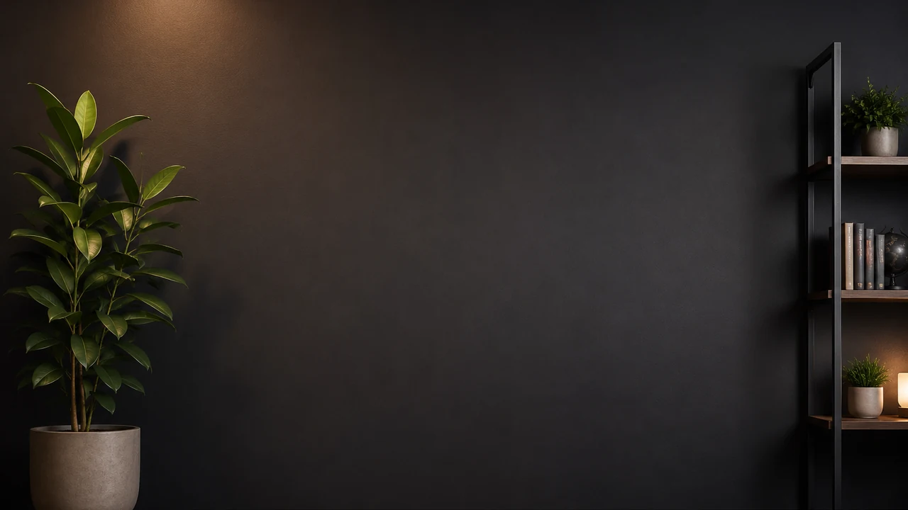
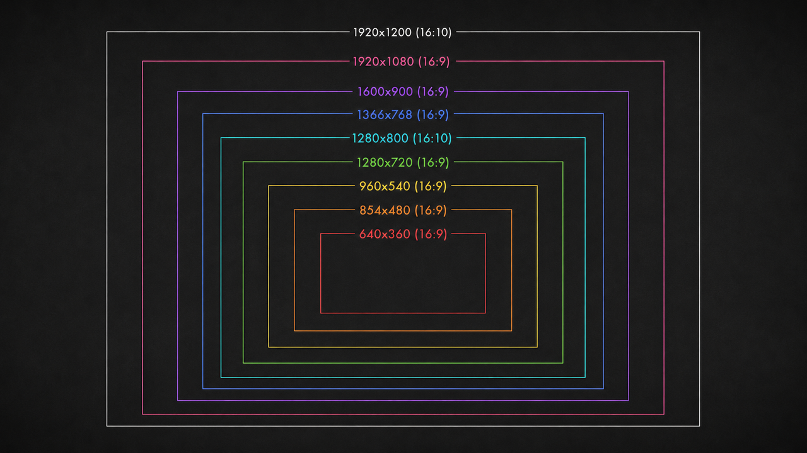

<p align="center">
  
</p>

# react-native-webrtc-kaleidoscope

[](#status)
[](https://www.npmjs.com/package/react-native-webrtc-kaleidoscope)
[](https://www.npmjs.com/package/react-native-webrtc-kaleidoscope)
[](https://github.com/simiancraft/react-native-webrtc-kaleidoscope/actions/workflows/ci.yml)
[](https://codecov.io/gh/simiancraft/react-native-webrtc-kaleidoscope)
[](https://securityscorecards.dev/viewer/?uri=github.com/simiancraft/react-native-webrtc-kaleidoscope)
[](./LICENSE)

> Creative, shader-based video effects for React Native video calls: blur or replace a person's background, with more camera effects to come. Works with `react-native-webrtc` and LiveKit, managed-Expo-friendly.

## Status

**Active development; not yet production-ready.** Published to npm at `1.0.0` (semantic-release cut the first tag at 1.0.0; the number reflects release automation, not a maturity claim). The npm presentation, marketing, and release-quality polish will come in a later pass; right now the README's job is to tell the truth about what works.

### What works today

- **Transform** (flip X / flip Y / rotate 90° CW / CCW) — orientation utilities, identical across platforms.
- **Blur** (background blur, person stays sharp).
- **Background replacement** (composite a still image behind the segmented person; eleven bundled presets, plus arbitrary URLs on web; library-side asset pipeline).
- **Runtime tuning** of the GLSL effects; see the [Use](#use) section.

| Platform | Transform | Blur | Background replacement | Notes |
|---|---|---|---|---|
| Web (Chrome / Edge) | ✓ | ✓ | ✓ | MediaStreamTrackProcessor + MediaPipe Selfie Segmentation (WASM, CDN) |
| Android (API 24+) | ✓ | ✓ | ✓ | OpenGL ES 3.0 + MediaPipe Selfie Segmentation (Tasks) |
| iOS (≥ 15) | ✓ | ✓ | ✓ | Metal + Vision (person segmentation), verified on device. Older A11 devices (iPhone X) run at a lower frame rate |
| Safari / Firefox | — | — | — | No Insertable Streams; `applyVideoEffects` throws a clear capability error |

### Coming soon

- **Procedural backgrounds** (animated shaders behind the person, not just still images). Same composite path; the only new piece is each effect's background producer.
- A careful pass over the npm presentation, install docs, and demo polish before any "we recommend you use this" framing.

## Install

```sh
bun add react-native-webrtc react-native-webrtc-kaleidoscope
```

`react-native-webrtc` is a peer dependency. Install it explicitly.

### Using LiveKit?

If your project uses `@livekit/react-native` it pulls in `@livekit/react-native-webrtc`, a fork of upstream `react-native-webrtc` that preserves the same `videoEffects` native classes and the `_setVideoEffects` JS API. Kaleidoscope works against either fork; the Android Gradle script picks whichever one your autolinking surfaced.

```sh
bun add @livekit/react-native @livekit/react-native-webrtc react-native-webrtc-kaleidoscope
```

Pick one fork. Installing both upstream `react-native-webrtc` and `@livekit/react-native-webrtc` in the same app will cause native class collisions; that's the consumer's problem to resolve.

**Native wiring.** `@livekit/react-native` hands you a `LocalVideoTrack`; apply effects to its underlying `MediaStreamTrack`:

```ts
import { applyVideoEffects } from 'react-native-webrtc-kaleidoscope';

applyVideoEffects(localCameraTrack.mediaStreamTrack, ['blur']);
```

**Web wiring.** On web, LiveKit owns the `RTCRtpSender`, so you cannot swap the track yourself; go through LiveKit's processor API instead. The opt-in `/livekit` subpath ships a ready-made processor (it needs `livekit-client`, which a LiveKit app already has):

```ts
import { KaleidoscopeProcessor } from 'react-native-webrtc-kaleidoscope/livekit';

await localVideoTrack.setProcessor(new KaleidoscopeProcessor(['blur']), true);
```

The second argument shows the processed stream in your local preview. The processor tears down its Insertable-Streams pipeline on camera flip (`restart`) and unpublish (`destroy`), so repeated flips do not leak generators.

## Configure

Add the config plugin to `app.config.ts`:

```ts
export default {
  expo: {
    plugins: ['react-native-webrtc-kaleidoscope'],
  },
};
```

(`react-native-webrtc` 124.x does not ship a config plugin upstream; do not list it in `plugins`. If you are on a fork that adds one, add it explicitly.)

Then rebuild native code:

```sh
bunx expo prebuild
```

## Use

```ts
import { mediaDevices } from 'react-native-webrtc';
import {
  applyVideoEffects,
  setBlurSigma,
  setMaskHardness,
  setMaskThreshold,
} from 'react-native-webrtc-kaleidoscope';
import { darkOffice } from 'react-native-webrtc-kaleidoscope/backgrounds/dark-office';

const stream = await mediaDevices.getUserMedia({ video: true });
const [track] = stream.getVideoTracks();

applyVideoEffects(track, ['flip-x']); // also flip-y, rotate-cw, rotate-ccw
applyVideoEffects(track, ['blur']);
applyVideoEffects(track, [{ name: 'background-image', source: darkOffice }]);
applyVideoEffects(track, []); // clear all effects

// Runtime tuning (effects pick up the new values on the next frame):
setBlurSigma(5);         // Gaussian σ; clamped to [0.5, 7], default 5.
setMaskHardness(0.5);    // smoothstep transition width; clamped to [0, 1]. 0 = soft halo, 1 = near-step. Default 0.5.
setMaskThreshold(0.7);   // smoothstep center; clamped to [0.05, 0.95]. Higher rejects low-confidence pixels. Default 0.7.
```

Effects chain in array order.

**Tuning note:** optimal values are platform-specific because the segmentation models differ. Web and Android both run MediaPipe Selfie Segmentation; iOS runs Apple Vision person segmentation, which produces a different confidence distribution. Working defaults on a typical well-lit scene (the Android values below predate the MLKit-to-MediaPipe swap and are being re-dialed):

| Platform | Blur sigma | Mask hardness | Mask threshold |
|---|---|---|---|
| Web (MediaPipe) | 25 | 0.2 | 0.85 |
| Android (MediaPipe) | 30 | 0.2 | 0.6 |

The library ships defaults (5, 0.5, 0.7) and consumers tune at runtime via the API above; whether to ship the dialed-in per-platform values as defaults is an open question.

## Background presets

Eleven backgrounds ship for the `background-image` effect, imported per preset (e.g. `import { darkOffice } from 'react-native-webrtc-kaleidoscope/backgrounds/dark-office'`). On web a preset can also be any image URL or data URI; native resolves bundled preset names only.

| Theme | Light | Dark |
|---|---|---|
| Office |  |  |
| Home |  |  |
| Nature |  |  |
| Stylized |  |  |
| Simiancraft |  |  |

Plus **`debug-resolutions`**, a viewport/resolution calibration grid for verifying background cover-fit:



See [`src/backgrounds/README.md`](./src/backgrounds/README.md) for sizing and how to add a preset.

## Web and native differences

The API surface is the same across platforms, but the runtimes differ in ways worth knowing before you wire effects in:

- **Effect parameters.** Web reads tuning from the global setters (`setBlurSigma`, `setMaskHardness`, `setMaskThreshold`) on the next frame. Native currently ignores per-call `EffectSpec` parameters such as `{ name: 'blur', sigma: 12 }`; tuning is global through the same setters. Per-call uniforms through the native registry are a follow-up.
- **Background source.** `background-image.source` is a bundled preset name on native (the upstream `_setVideoEffects` registry is keyed by flat strings, not URIs), but on web it accepts either a preset name or an arbitrary image URL or data URI.
- **Background presets ship as tree-shakeable files.** The bundled backgrounds (see [Background presets](#background-presets)) are importable per preset: `import { darkOffice } from 'react-native-webrtc-kaleidoscope/backgrounds/dark-office'`. Each preset is its own file behind its own subpath export, and the package sets `sideEffects: false`, so an unused preset is dropped by web bundlers — and, since Metro doesn't tree-shake, simply never imported on native. Web resolves the bundled WebP to a URL; native loads its own bundled copy by name. Web also still accepts an arbitrary image URL or data URI. See [`src/backgrounds/README.md`](./src/backgrounds/README.md).
- **Segmentation model on web.** The web blur and background-image effects load MediaPipe Selfie Segmentation from the jsdelivr CDN (`cdn.jsdelivr.net/npm/@mediapipe/selfie_segmentation`) on first use. A strict Content-Security-Policy must allow that origin for `script-src`, `connect-src`, and the WASM fetch, and the effects do not work offline. Mirror needs no model.
- **Browser support on web.** Effects use Insertable Streams (`MediaStreamTrackProcessor` and `MediaStreamTrackGenerator`), which ship in Chromium-based browsers (Chrome, Edge); Safari and Firefox lack the API, so `applyVideoEffects` throws a clear capability error and the demo falls back to the unprocessed track.

## What this isn't

- **Not a fork of `react-native-webrtc`.** A thin layer over its undocumented `_setVideoEffects` registry on native, and `MediaStreamTrackProcessor` on web. Install alongside `react-native-webrtc`.
- **Not a managed cloud SaaS.** Effects run locally on the device; the track stays peer-to-peer. No service, no API key, no per-minute billing.
- **Not a face-filter SDK.** Effects are background segmentation and frame transforms, not facial AR.
- **Not a streaming protocol replacement.** The transformed track plugs into the consumer's existing `RTCPeerConnection` pipeline.

## Architecture

The codebase lives across four surfaces:

- `src/` — JS facade and shared types. `applyVideoEffects(track, effects)` plus runtime tuning setters.
- `src/web/` — WebGL2 pipeline. MediaPipe segmentation + GLSL composite. One shader file per stage in `src/web/shaders.ts`.
- `android/` — OpenGL ES 3.0 pipeline. MediaPipe Tasks segmentation (async, worker-thread, last-known-mask cache) + GLSL composite. Shaders inline in `gpu/Shaders.kt` as `const val` strings.
- `ios/` — Metal pipeline (Swift) with Vision person segmentation. The canonical GLSL in `shaders/` transpiles to Metal Shading Language via `scripts/build-shaders.ts`. Implemented and verified on device.

The composite shader (`shaders/composite.frag`) is the same GLSL source for every effect category (blur, background-image, future procedural backgrounds). Per-effect difference is upstream of the composite: how the `uBackground` texture gets produced.

See [`PATTERNS.md`](./PATTERNS.md) for the file-layout conventions, texture-orientation contract, and recipe for adding new effects, shaders, presets, or tunable parameters.

## Reference

- [CONTRIBUTING.md](./CONTRIBUTING.md): setup, scripts, commit conventions.
- [AGENTS.md](./AGENTS.md): agent and contributor orientation.
- [PATTERNS.md](./PATTERNS.md): codebase conventions and how-to-extend.
- [SECURITY.md](./SECURITY.md): security policy and reporting.
- [NOTICE.md](./NOTICE.md): third-party attributions.
- Sibling projects: [chromonym](https://github.com/simiancraft/chromonym) and [unitforge](https://github.com/simiancraft/unitforge); same OSS-hygiene template.

---

MIT licensed. © 2026 Jesse Harlin / [Simiancraft](https://github.com/simiancraft).
